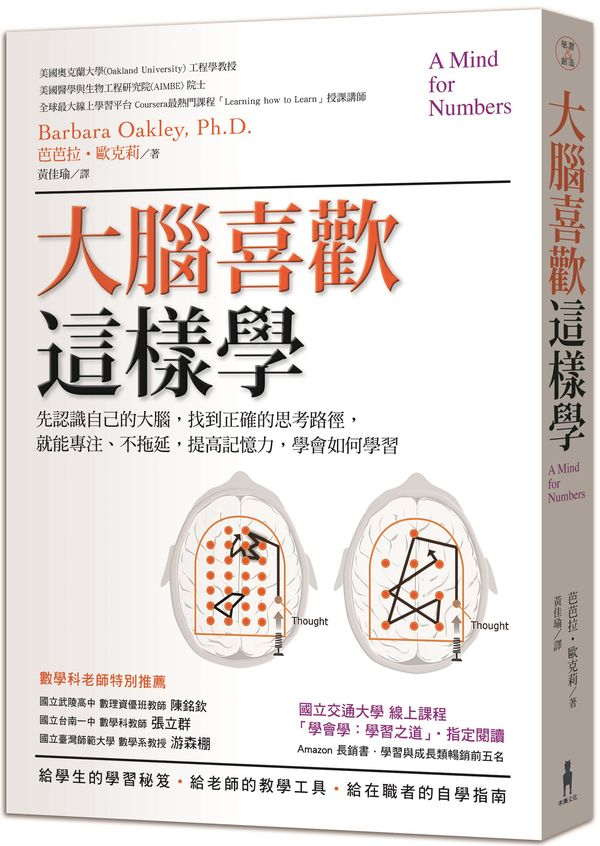

    

## 為何我推薦這本書？

這本書至少符合「好書」的其中兩個條件
- 給予我新穎的觀點去了解世界：透過這本書讓我更清楚如何善用大腦的本質去學習新知，處理我面對的任何問題。
- 提出實際的方法去改善我目前的生活：我覺得過去的我容易有拖延的習慣，這本書有針對這點提供很實際的建議。

## 這本書啟發了我什麼？

這本書啟發我最大的有兩點：
1. 大腦的發散與專注模式：不知大家是否有類似的經驗，不論是算數學或是寫程式等需要腦力的事情，有時候我們會長時間卡在一個問題點上不知道如何解決。這時候一個很有效的解決方式就是先出門散個步放鬆一下，再回來解決問題。其實這背後的原因就是大腦專注與發散模式的切換，當我們在解決問題時，大腦的專注模式會啟動，通常這適用在我們已知如何解決的問題(但依然需要靠專注力)；而遇到問題時不管如何想都想不出來是因為專注模式會容易將想法聚焦在某一塊，不懂得跳脫出來，而解答時常需要其他巧思。大腦的發散模式便是可以幫助我們去「天馬行空」地去找尋可能性，即使出門散個步放鬆同時，大腦的發散模式其實已經在背景運作中了！
2. 拖延症的解決：會導致拖延症的原因有很多，例如完美主義，問題難度太高導致壓力太大，害怕失敗等。然而，只要開始動手做個幾分鐘，我們自然而然就不會有拖延的想法，所以最難的其實是如何讓我們開始去做。書中提到的方法是不要去管完成度，你就讓自己先做個25分鐘，再回頭看看自己所做出來的成果，通常你會發現沒有你想像中的那麼糟。
3. 記憶：學習不能像囫圇吞棗那樣想一口氣讀完一本書，比較好的做法是每天固定讀一點，主要原因是長期的記憶效果較佳。

## 參考資源

[Coursera: Learning How to Learn](https://zh-tw.coursera.org/learn/learning-how-to-learn)

Barbara Oakley: "Learning How to Learn" | Talks at Google

    <iframe width="100%" height="450" src="https://www.youtube.com/embed/vd2dtkMINIw" frameborder="0" allow="accelerometer; autoplay; encrypted-media; gyroscope; picture-in-picture" allowfullscreen></iframe>

Learning How to Learn 主題演講：學習如何學習│Future Faculty Talk 臺大公開論壇

    <iframe width="100%" height="450" src="https://www.youtube.com/embed/4AeLa7P1eP8" frameborder="0" allow="accelerometer; autoplay; encrypted-media; gyroscope; picture-in-picture" allowfullscreen></iframe>

## 邀您來讀

想讀原文書
- 如果您是Amazon的用戶，歡迎使用<a href="https://amzn.to/2M2DMhZ" target="_blank">此連結購買</a>
- 如果您是Google Play Books的用戶，歡迎使用<a href="https://books.google.com.tw/books/about/Learning_How_to_Learn.html?id=FTM-DwAAQBAJ&redir_esc=y" target="_blank">此連結購買</a>

想讀中文書
- 新書
    - 如果您是博客來的用戶，歡迎使用<a href="https://www.books.com.tw/exep/assp.php/cyyeh40423/products/0010764994?utm_source=cyyeh40423&utm_medium=ap-books&utm_content=recommend&utm_campaign=ap-201905" target="_blank">此連結購買</a>
    - 如果您是TAAZE的用戶，歡迎使用<a href="https://www.taaze.tw/apredir.html?144150296/https://www.taaze.tw/goods/11100826877.html?a=b" target="_blank">此連結購買</a>
- 二手書
    - 如果您是TAAZE的用戶，歡迎使用<a href="https://www.taaze.tw/usedList.html?oid=11100826877" target="_blank">此連結購買</a>