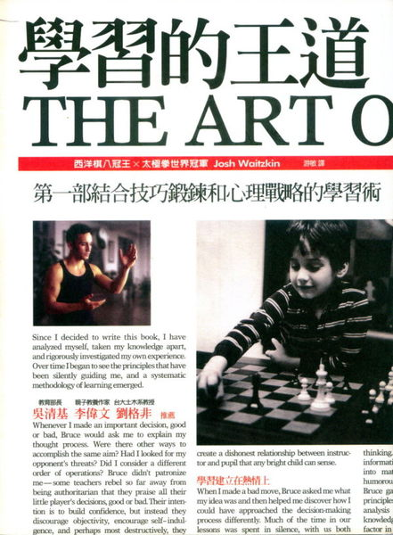

    

## 為何我推薦這本書？

這本書至少符合「好書」的其中一個條件
- 給予我新穎的觀點去了解世界：作者在書中鉅細靡迷地描述從他小時候遇上西洋棋，愛上西洋棋，正式學習並從師，參加比賽到後面奪冠走過來的點點滴滴。作者除了分享自己的故事，也提供學習的建議，父母教養的建議還有如何針對不同時期的學習給予不同的策略。

## 這本書啟發了我什麼？

這本書主要有兩點吸引我：
1. 我本身不會西洋棋，我很好奇不同領域的「成功」人士在學習與心態上和我所認知的有何相似與相異之處。
2. 這本書最令我驚豔的是他不只講自己的學習，還講周遭環境如何影響他學習的成效，例如親子之間的關係，與老師之間的關係等。

我扼要講一下書中一段直到目前最令我印象深刻的：

作者在書中描寫到小時候曾經參加一場比賽，然後比輸了。他的父母對於他比賽比輸而難過這件事並不會逃避回應，例如跟他說不要哭，這沒什麼。因為打從作者心底，他哭就是因為他在意這場比賽。作者的父母選擇第一時間去擁抱他，然後安慰他，並且讓他知道他的努力沒有白費，且陪孩子去做一件可以讓他療傷充電的活動。

## 參考資源

[Josh Waitzkin Official Website](https://www.joshwaitzkin.com/)

學習的王道部分筆記(第一部分)

    <iframe src="//www.slideshare.net/slideshow/embed_code/key/giZuNeN6v5r541" width="595" height="485" frameborder="0" marginwidth="0" marginheight="0" scrolling="no" style="border:1px solid #CCC; border-width:1px; margin-bottom:5px; max-width: 100%;" allowfullscreen></iframe>

Josh Waitzkin | Talks at Google

    <iframe width="100%" height="450" src="https://www.youtube.com/embed/gTZS3SqpT-o" frameborder="0" allow="accelerometer; autoplay; encrypted-media; gyroscope; picture-in-picture" allowfullscreen></iframe>

Josh Waitzkin Interview | Full Episode | Tim Ferriss Show (Podcast)

    <iframe width="100%" height="450" src="https://www.youtube.com/embed/LYaMtGuCgm8" frameborder="0" allow="accelerometer; autoplay; encrypted-media; gyroscope; picture-in-picture" allowfullscreen></iframe>

## 邀您來讀

想讀原文書
- 如果您是Amazon的用戶，歡迎使用<a href="https://amzn.to/2QHse2G" target="_blank">此連結購買</a>
- 如果您是Google Play Books的用戶，歡迎使用<a href="https://books.google.com.tw/books?id=8mrVx8Lj5RYC" target="_blank">此連結購買</a>

想讀中文書
- 新書
    - 如果您是博客來的用戶，歡迎使用<a href="https://www.books.com.tw/exep/assp.php/cyyeh40423/products/0010445494?utm_source=cyyeh40423&utm_medium=ap-books&utm_content=recommend&utm_campaign=ap-201906" target="_blank">此連結購買</a>
    - 如果您是TAAZE的用戶，歡迎使用<a href="https://www.taaze.tw/apredir.html?144150296/https://www.taaze.tw/goods/11100209287.html?a=b" target="_blank">此連結購買</a>
- 二手書
    - 如果您是TAAZE的用戶，歡迎使用<a href="https://www.taaze.tw/usedList.html?oid=11100209287" target="_blank">此連結購買</a>