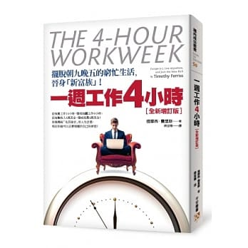

    

## 為何我推薦這本書？

這本書至少符合「好書」的其中兩個條件
- 給予我新穎的觀點去了解世界：「新富族」這個詞是我從這本書學到的一個新想法與新的生活態度，傳統的工作方式是將退休(假設65歲以後)當作「犒賞自己然後可以無憂無慮遊山玩水」的時間點；新富族不這麼看，他們會在工作之餘，就安排短期的「小退休」生活，讓自己能放鬆也能充電好面對接下來的挑戰。
- 提出實際的方法去改善我目前的生活：新富族是一個十分強調生產力與效率的族群，假設手邊有一份工作需要花錢，但在考量機會成本的情況下，將手邊工作外包是很正常的事情。這樣的思考方式讓我學會擁有一個新視角去拿捏手邊的大小事務。

## 這本書啟發了我什麼？

老實說，當初是因為書的標題實在是太吸引人才買來看的，因為我實在很好奇一週工作四小時到底是如何辦到的。看完書之後發現，新富族的生活態度就是想辦法在有限資源下，將自己的生產力最大化。從這個思考點來出發，就不難想到各種辦法來有效利用時間了，例如：行政外包(結合不同時區的特性，當你在睡覺時，你的行政助理幫你完成行政事務，隔天你就可以無縫接軌，如同工廠24小時不停運作)。其實，我覺得這本書就是引導大家如何用一個「企業家」的態度與精神去經營自己的生活。

## 參考資源

[The 4-Hour Workweek : Escape 9-5, Live Anywhere, and Join the New Rich: Official Site](https://fourhourworkweek.com/)

Tim Ferriss | The 4 Hour Method | Oxford Union

    <iframe width="100%" height="450" src="https://www.youtube.com/embed/CvYitCV9m848" frameborder="0" allow="accelerometer; autoplay; encrypted-media; gyroscope; picture-in-picture" allowfullscreen></iframe>

The 4 Hour Workweek Revisited | The Tim Ferriss Show (Podcast)

    <iframe width="100%" height="450" src="https://www.youtube.com/embed/4u3HZ9WduqE" frameborder="0" allow="accelerometer; autoplay; encrypted-media; gyroscope; picture-in-picture" allowfullscreen></iframe>

## 邀您來讀

想讀原文書
- 如果您是Amazon的用戶，歡迎使用<a href="https://amzn.to/2F26c5X" target="_blank">此連結購買</a>
- 如果您是Google Play Books的用戶，歡迎使用<a href="https://books.google.com.tw/books/about/The_4_Hour_Workweek_Expanded_and_Updated.html?id=dxumVrUrpYcC&redir_esc=y" target="_blank">此連結購買</a>
- 如果您是博客來的用戶，歡迎使用<a href="https://www.books.com.tw/exep/assp.php/cyyeh40423/products/F011770042?utm_source=cyyeh40423&utm_medium=ap-books&utm_content=recommend&utm_campaign=ap-201906" target="_blank">此連結購買</a>

想讀中文書
- 新書
    - 如果您是博客來的用戶，歡迎使用<a href="https://www.books.com.tw/exep/assp.php/cyyeh40423/products/0010621037?utm_source=cyyeh40423&utm_medium=ap-books&utm_content=recommend&utm_campaign=ap-201906" target="_blank">此連結購買</a>
    - 如果您是TAAZE的用戶，歡迎使用<a href="https://www.taaze.tw/apredir.html?144150296/https://www.taaze.tw/goods/11100685794.html?a=b" target="_blank">此連結購買</a>
- 二手書
    - 如果您是TAAZE的用戶，歡迎使用<a href="https://www.taaze.tw/usedList.html?oid=11100685794" target="_blank">此連結購買</a>