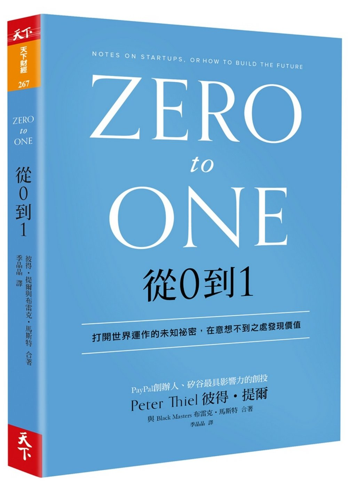

    

## 為何我推薦這本書？

這本書至少符合「好書」的其中一個條件
- 給予我新穎的觀點去了解世界：「避免競爭」是我從這本書學到最大的收穫。我們從受教育以來，就是在競爭的環境下長大，每個人學習「幾乎一樣」的知識，用「幾乎一樣」的標準去看待個人。放在商場的世界，就是企業間生產同質性過高的商品，彼此競爭。避免競爭然後創造獨佔事業是這本書所傳達的一個很重要的理念。

## 這本書啟發了我什麼？

截至目前為止，這本書我已經讀第三遍了。其實早在它2014年出版時，我就讀過了！多年回過頭再讀一遍，避免競爭的觀點還是讓我眼睛為之一亮。我覺得即使大家沒有想要走創業的路，但是把自己當作是一家公司在經營，產品就是你各式專長，個性，特色的總和來看待的話，我想就有趣了。在市面上符合同一個職位能力的人滿街跑，那為何是你目前坐在這個位子而且如何讓你突破自己(產品創新)就是一個令人執得深思的問題。

最後節錄一個檢查表供各位作參考：(不管投身哪個行業，優秀的事業計畫都必須研究這七個問題)
1. 工程問題：你創造的是一個突破的科技，還是一種微幅改善的方法？
2. 時機問題：現在是開始這個事業的正確時機嗎？
3. 獨佔問題：你一開始就先在小型市場搶得高市佔率嗎？
4. 人員問題：你有合適的團隊嗎？
5. 銷售問題：你除了有開發產品的能力，還有銷售計畫嗎？
6. 持久問題：你的市場定位可以堅持10年，20年嗎？
7. 秘密問題：你是否已經找到別人沒看見的獨特商機？

## 參考資源

Peter Thiel Returns to Stanford to Share Business Tips from "Zero to One"

    <iframe width="100%" height="450" src="https://www.youtube.com/embed/6kGND-uZolY" frameborder="0" allow="accelerometer; autoplay; encrypted-media; gyroscope; picture-in-picture" allowfullscreen></iframe>

Competition is for Losers with Peter Thiel (How to Start a Startup 2014: 5)

    <iframe width="100%" height="450" src="https://www.youtube.com/embed/3Fx5Q8xGU8k" frameborder="0" allow="accelerometer; autoplay; encrypted-media; gyroscope; picture-in-picture" allowfullscreen></iframe>

## 邀您來讀

想讀原文書
- 如果您是Amazon的用戶，歡迎使用<a href="https://amzn.to/2Rj3FJm" target="_blank">此連結購買</a>
- 如果您是Google Play Books的用戶，歡迎使用<a href="https://books.google.com.tw/books/about/Zero_to_One.html?id=Owc2nQEACAAJ&redir_esc=y" target="_blank">此連結購買</a>
- 如果您是博客來的用戶，歡迎使用<a href="https://www.books.com.tw/exep/assp.php/cyyeh40423/products/F013587397?utm_source=cyyeh40423&utm_medium=ap-books&utm_content=recommend&utm_campaign=ap-201906" target="_blank">此連結購買</a>

想讀中文書
- 新書
    - 如果您是博客來的用戶，歡迎使用<a href="https://www.books.com.tw/exep/assp.php/cyyeh40423/products/0010651050?utm_source=cyyeh40423&utm_medium=ap-books&utm_content=recommend&utm_campaign=ap-201906" target="_blank">此連結購買</a>
    - 如果您是Readmoo的用戶，歡迎使用<a href="http://moo.im/a/02gGKT" target="_blank">此連結購買</a>
    - 如果您是Google Play Books的用戶，歡迎使用<a href="https://books.google.com.tw/books/about/%E5%BE%9E0%E5%88%B01.html?id=pyAWogEACAAJ&redir_esc=y" target="_blank">此連結購買</a>
    - 如果您是TAAZE的用戶，歡迎使用<a href="https://www.taaze.tw/apredir.html?144150296/https://www.taaze.tw/goods/11100720260.html?a=b" target="_blank">此連結購買</a>
- 二手書
    - 如果您是TAAZE的用戶，歡迎使用<a href="https://www.taaze.tw/usedList.html?oid=11100720260" target="_blank">此連結購買</a>