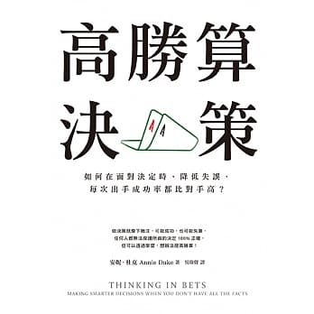

    

## 為何我推薦這本書？

這本書至少符合「好書」的其中兩個條件
- 給予我新穎的觀點去了解世界：差勁的決策結果不代表決策的品質就是差的，我們還要把不確定性的因素加進去。
- 提升我的能力：論語曰：「知之為知之 不知為不知 是知也。」然而，若是套用高勝算決策的思考模式，知道也是有分程度的，例如80%確定。學習以開放的態度去面對問題，仔細解讀自己的見解，嘗試以多種不同角度切入，與同伴討論，盡量減少認知偏差。

## 這本書啟發了我什麼？

作者是一位德州撲克的專家，她認為德州撲克的決策模式很適合搬到日常生活中，因為兩者都是資訊不完整，且包含運氣成份在裡頭，而德州撲克比較棘手的是需要在短時間內作出決定。這本書最讓我驚豔的就是「差勁的決策結果不代表決策的品質是差的」這句話。時常我們做了一個決策，看到決策不如預期，下意識就會認為自己做了錯誤的決策，而不是去思考是否其中有不可控制因素如運氣導致決策結果差強人意。人生困難的也就在於如何在兩者之間作抉擇，然後建立一個學習的回饋機制讓自己進步。另外，這本書也提出很多心理學實驗結果去告訴我們人類其實不是個那麼可靠的動物，各式各樣的認知偏差就在你我不自覺的情況下產生，所以，懂得反思(思考自己的思考過程)，有同伴給予建議等方法都是滿重要的。

## 參考資源

Annie Duke: "Thinking in Bets" | Talks at Google

    <iframe width="100%" height="450" src="https://www.youtube.com/embed/uYNsSeYjkp4" frameborder="0" allow="accelerometer; autoplay; encrypted-media; gyroscope; picture-in-picture" allowfullscreen></iframe>

[Making Smart Decisions When You Don’t Have All The Facts with Annie Duke](https://www.successpodcast.com/show-notes/2018/7/18/making-smart-decisions-when-you-dont-have-all-the-facts-with-annie-duke)

## 邀您來讀

想讀原文書
- 如果您是Amazon的用戶，歡迎使用<a href="https://amzn.to/2Yfyr93" target="_blank">此連結購買</a>
- 如果您是Google Play Books的用戶，歡迎使用<a href="https://books.google.com.tw/books/about/Thinking_in_Bets.html?id=hOZFDwAAQBAJ&redir_esc=y" target="_blank">此連結購買</a>

想讀中文書
- 新書
    - 如果您是博客來的用戶，歡迎使用<a href="https://www.books.com.tw/exep/assp.php/cyyeh40423/products/0010802907?utm_source=cyyeh40423&utm_medium=ap-books&utm_content=recommend&utm_campaign=ap-201906" target="_blank">此連結購買</a>
    - 如果您是Readmoo的用戶，歡迎使用<a href="http://moo.im/a/gjkmCP" target="_blank">此連結購買</a>
    - 如果您是Google Play Books的用戶，歡迎使用<a href="https://books.google.com.tw/books/about/%E9%AB%98%E5%8B%9D%E7%AE%97%E6%B1%BA%E7%AD%96.html?id=VHN5DwAAQBAJ&redir_esc=y" target="_blank">此連結購買</a>
    - 如果您是TAAZE的用戶，歡迎使用<a href="https://www.taaze.tw/apredir.html?144150296/https://www.taaze.tw/goods/11100859386.html?a=b" target="_blank">此連結購買</a>
- 二手書
    - 如果您是TAAZE的用戶，歡迎使用<a href="https://www.taaze.tw/usedList.html?oid=11100859386" target="_blank">此連結購買</a>